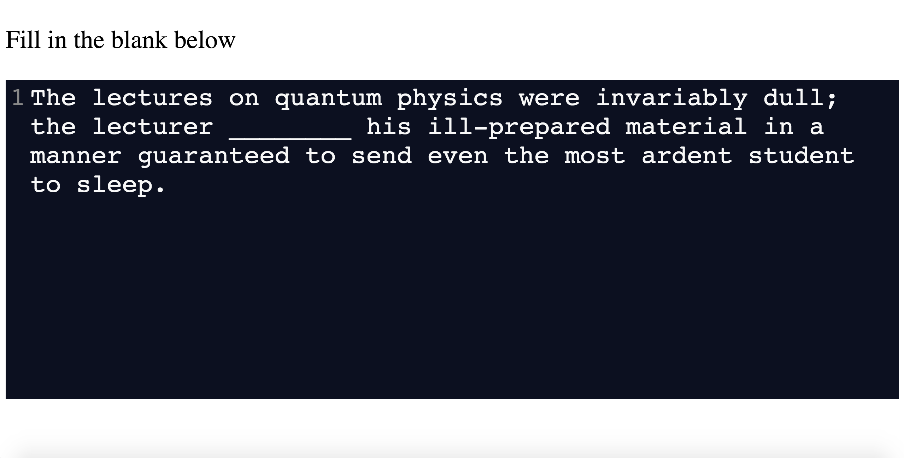

# CodeSynthViewer -- Install

CodeSynthViewer involves a [Node.js](https://nodejs.org/en/) back-end and a locally-hosted web-based front-end. Instructions for both installation and basic usage are outlined in the README of the repository, itself. However, we provide similar details here for the purpose of our submission: 

## Overview

Below is an enumerated list of the commands/requirements for running CodeSynthViewer. For more details, see the Prerequisites and Installation sections:
* Download [Node.js](https://nodejs.org/en/download/)
* Verify your Node.js installation with ``node -v``. Confirm that you also have the [Node Package Manager](https://nodejs.org/en/knowledge/getting-started/npm/what-is-npm) installed with ``npm -v``
* Navigate to the ``code-synth-viewer`` directory (i.e., ``cd path/to/code-synth-viewer'')
* Initialize the project as a node package with ``npm init``. Accept all default options.
* While in the ``code-synth-viewer`` directory, install the following packages with ``npm``: http, path, request, express, fs, and shuffle-seed. For example, ``npm install http``.
* Configure your keycode for the start key `=` as outlined below

## Prerequisites

The Backend Server is built with [Node.js](https://nodejs.org/en/) and requires the following packages:
* http
* path
* request
* express
* fs
* shuffle-seed

Before setting up CodeSynthViewer, you must verify that you have node installed (e.g., ``node -v`` and ``npm -v``). If you do not have Node.js installed, you can do so from [their website](https://nodejs.org/en/download/).

## Installation

Once you have verified your Node.js installation, you must initialize the CodeSynthViewer as a node package with the following commands: ``cd /path/to/code-synth-viewer && npm init``. You should accept all default options.

You can then install the above packages using the [Node Package Manager](https://nodejs.org/en/knowledge/getting-started/npm/what-is-npm/) in the ```code-synth-viewer``` directory (e.g., ```cd path/to/code-synth-viewer; npm install shuffle-seed```). This will create a directory ```node_modules``` in ```code-synth-viewer```. 

## Getting Started

Below are instructions for general usage of CodeSynthViewer

### Keyboard Configuration

Before using the software, you must change one line in ``presenter.html`` in correspondence with your environment. CodeSynthViewer uses the `=` key to trigger the start of the server. However, the Javascript ``event.keycode`` value for `=` varies by OS and web browser.

To check your keycode, navigate to https://keycode.info/ and press the `=` key. Then, update the following line in ``presenter.html``: ``if (event.keyCode == <YOUR KEYCODE HERE>) {``.

### General Usage

General usage for CodeSynthViewer involves a [Node.js](https://nodejs.org/en/) back-end and a locally-hosted web-based front-end. General usage requires the following steps:

1. Start the **Backend Server**, specifying the participant ID (used for a random number generator seed as well as for naming output files/directories) and the category (unique to the user's experimental design). Both are positive integers
2. Open the **Presenter** in a web browser
3. Press the designated key to start the experiment (default is "=")

To start the Backend Server, use

``node server.js [PARTICIPANT-ID] [CATEGORY]``

Then, open ``presenter.html`` in a web-browser. Lastly, press the designated start key. Below are sample images of expected behavior:

Rest Period             |  Active Stimulus
:-------------------------:|:-------------------------:
  |  

To replicate our experiments with a random ordering (e.g., random participant ID = 99), use the following commands:

* ``node server.js 99 [0-3]``
* ``open presenter.html``
* Press the "=" key

Note that we used four different categories of stimuli in our study. Each experiment can be run separately by selecting one of [0-3] as the category ID. In our study, the category IDs correspond to the following categories (FITB = Fill in the Blank, LR = Long Response):

0. Prose, FITB
1. Prose, LR
2. Code, FITB
3. Code, LR

The stimuli can be found in ```stimuli.json``` and are defined in this order.

