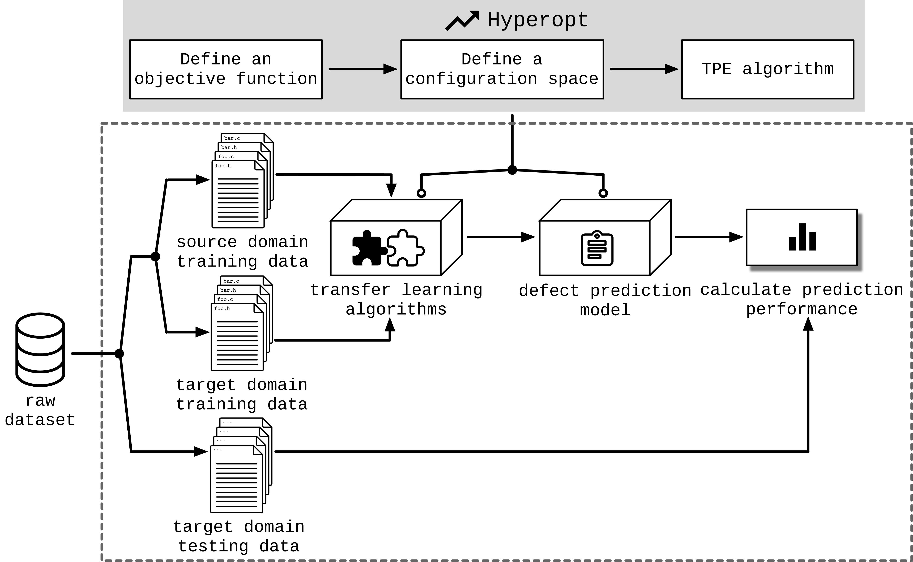

# Artifact Evaluation

This is the artifact, including the source code and dataset, for the ICSE 2020 Technical Track paper: "Understanding the Automated Parameter Optimization on Transfer Learning for Cross-Project Defect Prediction: An Empirical Study". A pre-print of this paper is available at Accepted Paper https://github.com/COLA-Laboratory/icse2020/blob/master/icse2020-paper1711.pdf.

## Background
Data-driven defect prediction has become increasingly important in software engineering process. Since it is not uncommon that data from a software project is insufficient for training a reliable defect prediction model, transfer learning that borrows data/knowledge from other projects to facilitate the model building at the current project, namely Cross-Project Defect Prediction (CPDP), is naturally plausible. Most CPDP techniques involve two major steps, i.e., transfer learning and classification, each of which has at least one parameter to be tuned to achieve their optimal performance. This practice fits well with the purpose of automated parameters optimization. However, there is a lack of thorough understanding about what are the impacts of automated parameters optimization on various CPDP techniques.

Bearing this consideration in mind, this paper presents the first empirical study that looks into such impacts on 62 CPDP techniques, 13 of which are chosen from the existing CPDP literature while the other 49 ones have not been explored before. We build defect prediction models over 20 real-world software projects that are of different scales and characteristics.

Our major finds are:
- Automated parameter optimization substantially improves the defect prediction performance of 77% CPDP techniques with a manageable computational cost. Thus more efforts on this aspect are required in future CPDP studies.
- Transfer learning is of ultimate importance in CPDP. Given a tight computational budget, it is more cost-effective to focus on optimizing the parameter configuration of transfer learning algorithms
- The research on CPDP is far from mature where it is ‘not difficult’ to find a better alternative by making a combination of existing transfer learning and classifica- tion techniques.

## Hyperopt for automated parameter optimisation

Hyperopt is a Python library that provides algorithms and software infrastructure to optimise hyperparameters of machine learning algorithms. In this project, we use Hyperopt as the optimiser (its basic optimisation driver is hyperopt.fmin) to optimise the parameter configurations of the CPDP techniques. The architecture of our automated parameter optimisation on CPDP model by using Hyperopt is as follows.

## Investigated datasets

+ AEEEM
+ JURECZKO (12 selected projects)
+ ReLink

## Installation

- `Python==3.6` is our the only running environment.
- Install thrid-party packages (In `Anacaonda` environment)
  - `pip install hyperopt`
  - `pip install scikit-learn==0.20.4`
  - `pip install iteration_utilities`
  - `conda install tqdm`
  - `pip install imbalanced-learn==0.4  `
  - `pip install func_timeout`
> If you choose to run the project directly without `Anaconda` environment, you should use `pip3` rather than `pip` to install above packages.

## A quick start to run experiments

> Please follow `INSTALL.md` before starting to run the code.

+ To evaluate the impact of parameter optimization on the transfer learning in CPDP, using command `python3 optADPT.py` in your terminal.
+ To evaluate the impact of parameter optimization on the classifier in CPDP, using command `python3 optCLF.py` in your terminal.
+ To evaluate the impact of parameter optimization on both transfer learning and classifier in CPDP simultaneously, using command `python3 optALL.py` in your terminal.
+ To evaluate the impact of parameter optimization in a sequential manner, i.e., optimising the parameters of transfer learning before those of the classifier, using command `python3 optSEQ.py` in your terminal.

## Expected output

Each script ends up producing two directories. For example,  

+ `resADPT`, the directory contains all optimized results for each combination on each project.
  
   - For each line in a `.txt` result file, the form is shown as follows
     $$
     \underset{default(auc)\quad optimized}{\underline{[0.5558\quad 0.7779]}} \{\underset{configuration}{\underline{neighbors:3}}\}
     $$
     
   
+ `paraADPT`, the directory contains all searched configurations for each combination on each project.

   - For each line in a `.txt` result file, the form is shown as follows
     $$
     [\underset{configuration-value}{\underline{3}} \quad \underset{performance (auc)}{\underline{0.7779}}]
     $$
     

## Estimated running time

> Because th budget is the number of function evaluation (1000), the running time of the script is affected by the specific algorithm.

Each script will run for 3 to 4 months without any parallelism.

## Further developments

> If you want to investigate more combinations (transfer learning algorithms + classification algorithms), please modify the following parts of code.

1. Add new transfer learning algorithms into `code\Algorithms\domainAdaptation.py`
2. Add new classification algorithms into `code\Algorithms\Classifier.py`
3. Modify the call format in `code\Alogrithms\Framework.py`

## Contact

If you meet any problems, please feel free to contact us.
+ Ke Li (k.li@exeter.ac.uk)
+ Zilin Xiang (zilin.xiang@hotmail.com)
+ Tao Chen (t.t.chen@lboro.ac.uk)
